<div align="center">

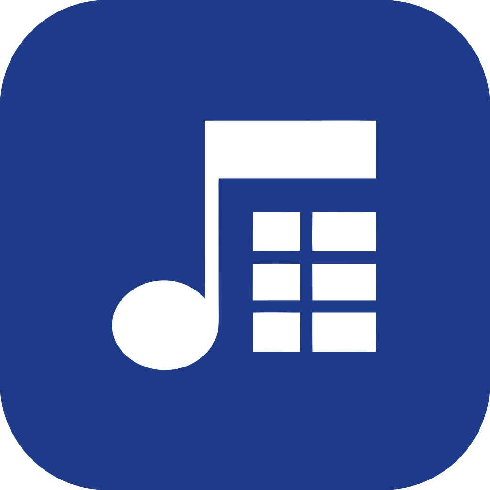

# S.R.M.E.

### Sistema de Registro de Músicos em Eventos

Aplicativo para cadastrar os músicos de uma orquestra, registrar quem esteve presente em cada evento e gerar relatórios em PDF, **tudo offline** e com o mesmo código rodando no **Android**, no **Windows** e no **Linux**.


<sub>Trabalho de Conclusão de Curso · Leonardo Henrique Tubero</sub>

<br/><br/>

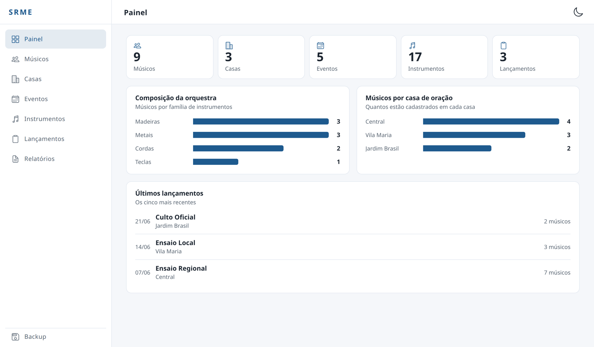

</div>

---

## 📌 Sumário

- [Sobre o projeto](#-sobre-o-projeto)
- [Funcionalidades](#-funcionalidades)
- [Telas](#-telas)
- [Relatórios](#-relatórios)
- [Tecnologias](#-tecnologias)
- [Arquitetura](#-arquitetura)
- [Modelo de dados](#-modelo-de-dados)
- [Como executar](#-como-executar)
- [Gerando os instaladores](#-gerando-os-instaladores)
- [Estrutura de pastas](#-estrutura-de-pastas)
- [Autor](#-autor)

---

## 🎯 Sobre o projeto

O controle de presença dos músicos em ensaios, cultos e demais eventos costuma ser feito em papel ou em planilhas soltas, o que torna difícil responder perguntas simples, como *"quantos músicos de cada família tocaram no último ensaio regional?"* ou *"quais músicos faltaram nos ensaios deste mês?"*.

O **S.R.M.E.** centraliza essas informações em um único aplicativo:

- 📋 **Cadastro** de músicos, casas de oração, eventos e instrumentos;
- ✅ **Lançamento** da presença dos músicos em cada evento realizado;
- 📊 **Painel** com um resumo da orquestra;
- 📄 **Relatórios em PDF** prontos para imprimir ou compartilhar;
- 💾 **Backup e restauração** dos dados em um arquivo.

Todos os dados ficam **no próprio dispositivo**, em um banco SQLite local. O app não depende de internet nem de servidor.

---

## ✨ Funcionalidades

| Módulo | O que faz |
| --- | --- |
| **Painel** | Totais cadastrados, composição da orquestra por família de instrumentos, músicos por casa de oração e os últimos lançamentos. |
| **Músicos** | Cadastro com nome, instrumento, casa de oração (comum congregação), cargo, se é oficializado e batizado. Impede dois músicos ativos com o mesmo nome. |
| **Casas de oração** | Cadastro das casas, com nome e cidade. |
| **Eventos** | Tipos de evento (ensaio regional, ensaio local, culto oficial, etc.). |
| **Instrumentos** | Instrumentos agrupados por família (Cordas, Madeiras, Metais, Teclas…). |
| **Lançamentos** | Registro de um evento realizado (data, local e tipo) e dos músicos que estavam presentes. |
| **Relatórios** | Quatro relatórios filtráveis, exportados em PDF. |
| **Backup** | Exporta o banco inteiro para um arquivo `.json` e restaura a partir dele. |

**Outros detalhes:**

- 🗑️ **Exclusão lógica:** registros são desativados em vez de apagados, preservando o histórico dos relatórios.
- 🔎 **Busca** nas listagens.
- 🌗 **Tema claro e escuro**, com a preferência salva.
- 🛡️ **Validações** de tamanho de campos e de datas (não aceita datas futuras nem de mais de 10 anos atrás).
- 🧭 **Avisos de pré-requisitos:** o app orienta o usuário quando falta algum cadastro básico (por exemplo, não dá para lançar presença sem ter eventos cadastrados).

---

## 📸 Telas

### 📱 No celular (Android)

No celular, a navegação fica numa barra de abas na parte de baixo da tela.

<table>
  <tr>
    <td align="center">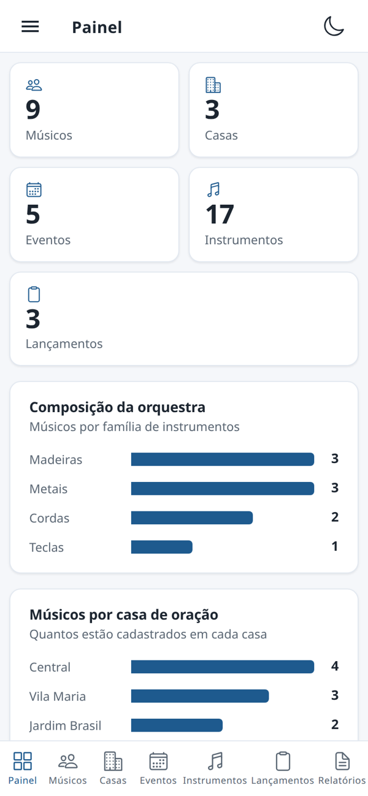<br/><sub><b>Painel</b></sub></td>
    <td align="center">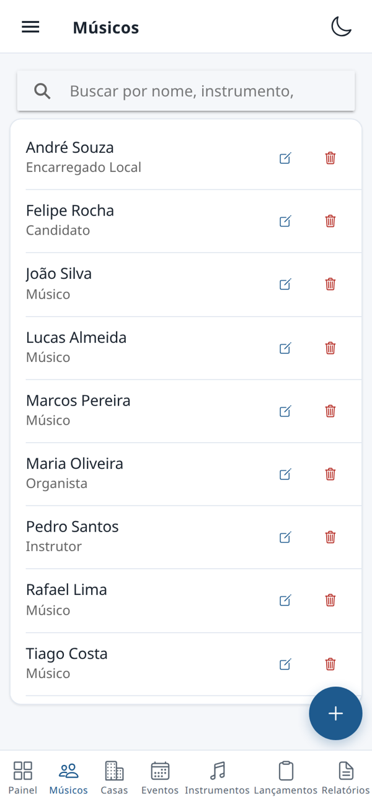<br/><sub><b>Músicos</b></sub></td>
    <td align="center">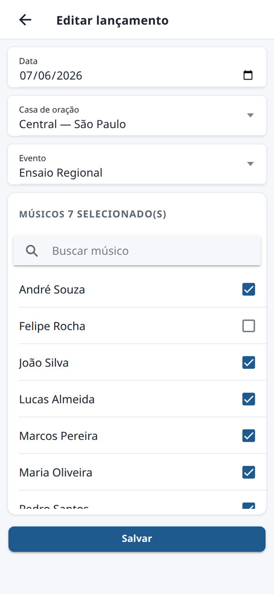<br/><sub><b>Lançamento de presença</b></sub></td>
    <td align="center">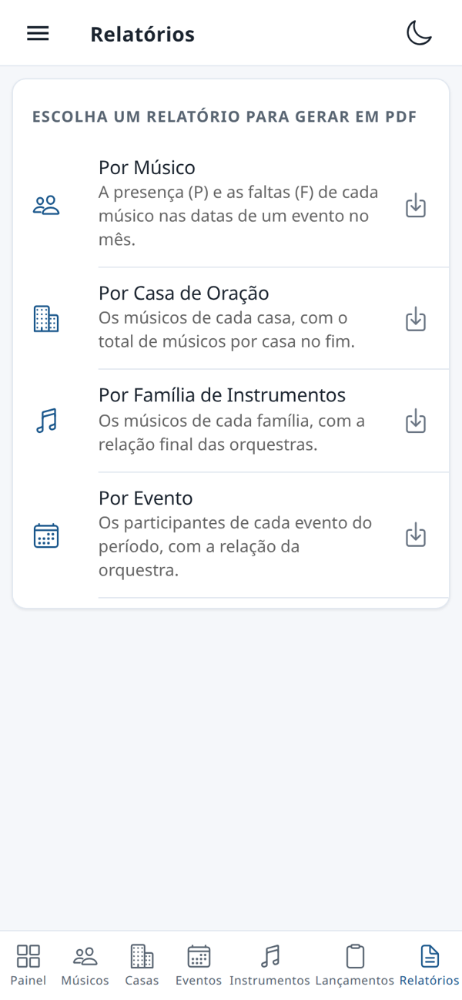<br/><sub><b>Relatórios</b></sub></td>
  </tr>
</table>

### 🖥️ No computador (Windows e Linux)

No computador, as abas viram um menu lateral e as listagens ganham colunas.

<table>
  <tr>
    <td align="center">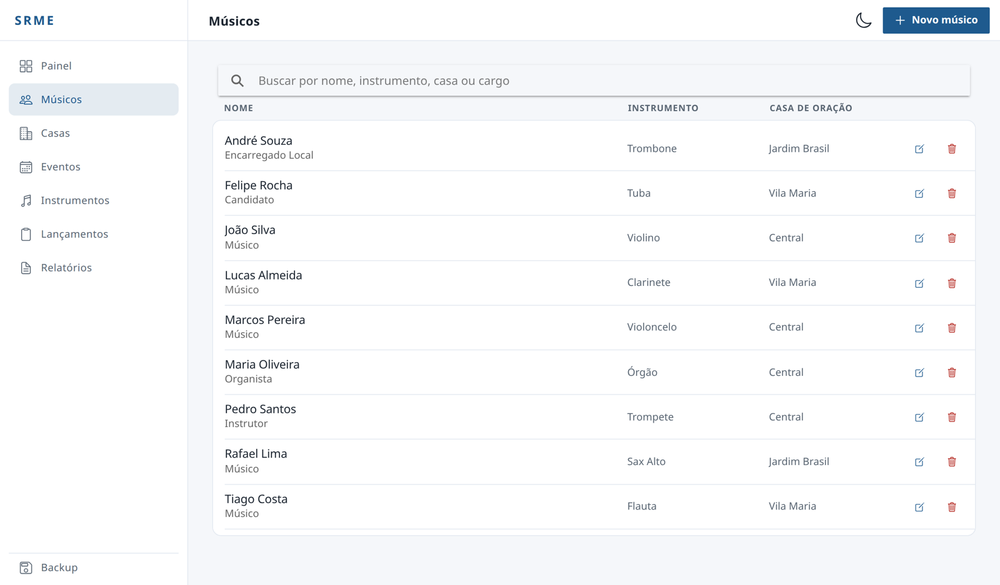<br/><sub><b>Músicos</b>: busca por nome, instrumento, casa ou cargo</sub></td>
    <td align="center">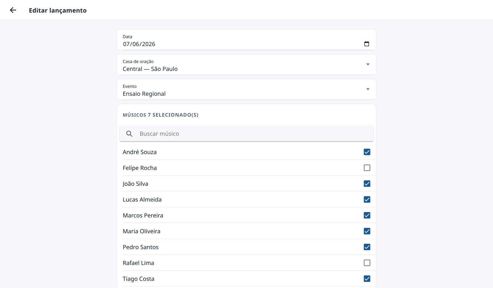<br/><sub><b>Lançamento</b>: data, local, evento e músicos presentes</sub></td>
  </tr>
  <tr>
    <td align="center">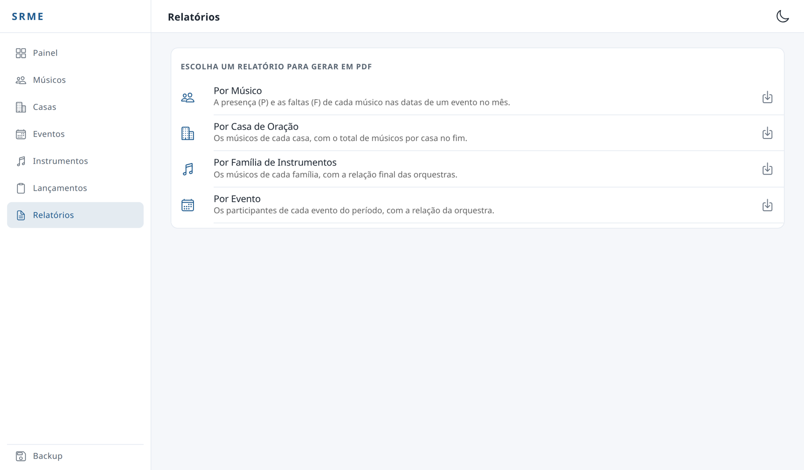<br/><sub><b>Relatórios</b>: quatro relatórios gerados em PDF</sub></td>
    <td align="center">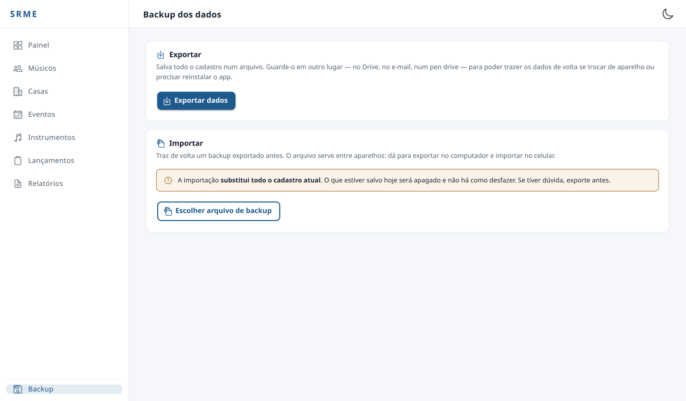<br/><sub><b>Backup</b>: exportar e importar todos os dados</sub></td>
  </tr>
</table>

### 🌗 Tema escuro

<p align="center">
  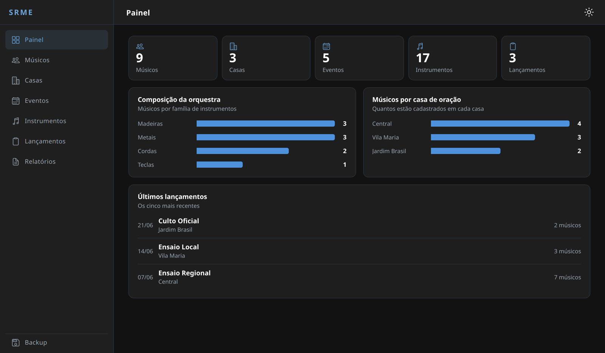
</p>

---

## 📄 Relatórios

| Relatório | Conteúdo | Filtros |
| --- | --- | --- |
| **Por Músico** | Grade de presença (**P**) e falta (**F**) de cada músico nas datas de um evento no mês. | Mês/ano, evento e casa de oração |
| **Por Casa de Oração** | Os músicos de cada casa, com o total por casa no final. | Casa de oração |
| **Por Família de Instrumentos** | Os músicos de cada família, com a relação final das orquestras. | Famílias e casa de oração |
| **Por Evento** | Os participantes de cada evento do período, com a relação da orquestra. | Período e casa de oração |

> Os percentuais das relações de orquestra não consideram a família **Teclas** (órgão), que é contabilizada à parte.

---

## 🛠️ Tecnologias

| Camada | Tecnologia |
| --- | --- |
| Interface | [Angular 20](https://angular.dev) (componentes *standalone* e *signals*) + [Ionic 8](https://ionicframework.com) |
| Linguagem | TypeScript 5.9 |
| Multiplataforma | [Capacitor 8](https://capacitorjs.com) (Android) e [Electron 42](https://www.electronjs.org) (desktop) |
| Banco de dados | SQLite via [`@capacitor-community/sqlite`](https://github.com/capacitor-community/sqlite) (e `jeep-sqlite` + `sql.js` no navegador) |
| PDF | [jsPDF](https://github.com/parallax/jsPDF) + `jspdf-autotable` |
| Arquivos e compartilhamento | `@capacitor/filesystem` e `@capacitor/share` |
| Qualidade | ESLint, Jasmine e Karma |

---

## 🏗️ Arquitetura

Uma única base de código Angular/Ionic é empacotada para cada plataforma. O acesso ao banco passa pelo plugin de SQLite do Capacitor, que usa a implementação nativa de cada ambiente.

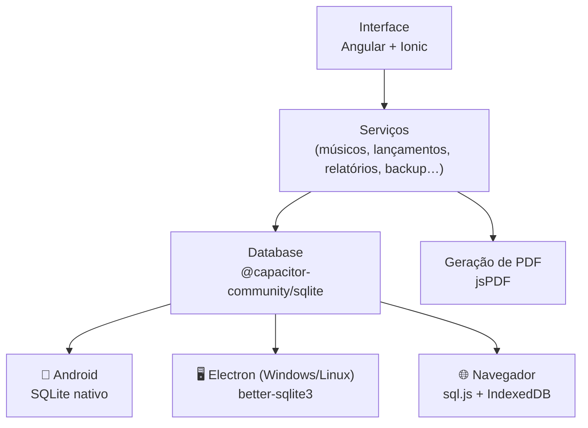

O código segue uma organização por funcionalidade:

- **`core/`**: o que é compartilhado pelo app inteiro: conexão e esquema do banco, modelos e serviços de regra de negócio;
- **`features/`**: uma pasta por tela (listagem e formulário);
- **`shared/`**: componentes, diretivas e serviços reutilizáveis (busca, confirmação, geração de PDF, troca de tema).

---

## 🗃️ Modelo de dados

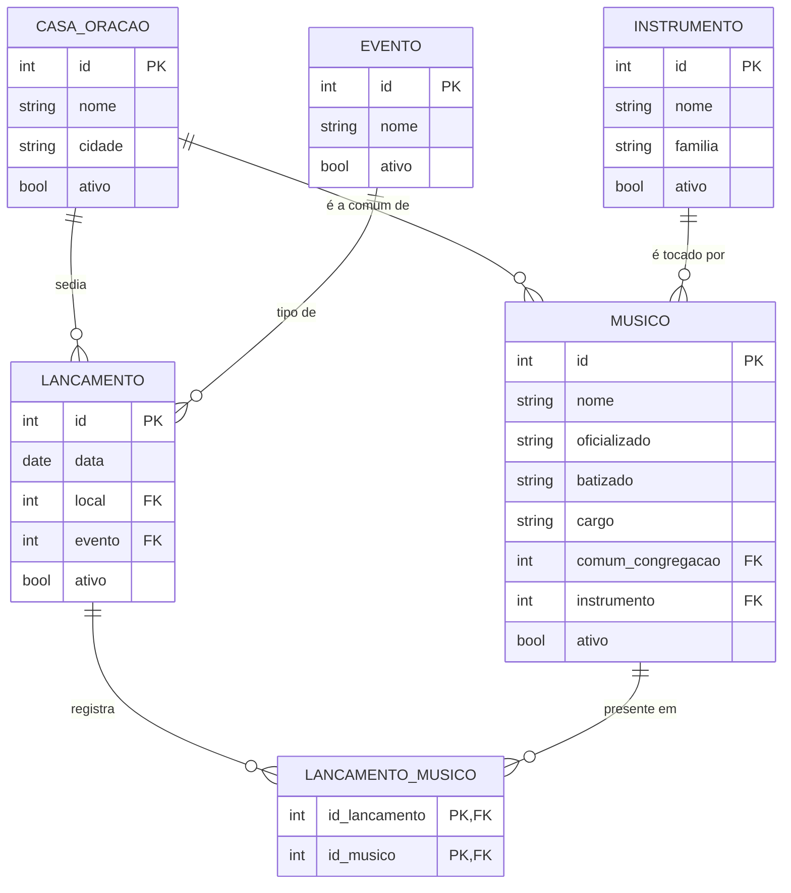

---

## 🚀 Como executar

### Pré-requisitos

- [Node.js](https://nodejs.org) 20 ou superior e npm
- Para Android: [Android Studio](https://developer.android.com/studio) e JDK 21
- Para empacotar para Windows a partir do Linux: [Wine](https://www.winehq.org)

### Instalação

```bash
git clone git@github.com:LeonardoHenriqueTubero/TCC---S.R.M.E..git TCC---S.R.M.E
cd TCC---S.R.M.E
npm install
npm --prefix electron install
```

### Rodando em desenvolvimento

| Onde | Comando |
| --- | --- |
| Navegador | `npm start` (abre em `http://localhost:4200`) |
| Desktop (Electron) | `npm run electron:start` |
| Android | `npm run android:sync` e depois abrir a pasta `android/` no Android Studio |

> 💡 Para popular o banco com dados de exemplo, mude `SEMEAR_DADOS_DE_AMOSTRA` para `true` em `src/app/core/database/database.ts`.

### Testes e lint

```bash
npm test
npm run lint
```

---

## 📦 Gerando os instaladores

| Plataforma | Comando | Saída |
| --- | --- | --- |
| Android (debug) | `npm run android:apk` | `android/app/build/outputs/apk/debug/` |
| Android (release) | `npm run android:release` | `android/app/build/outputs/apk/release/` |
| Linux | `npm run electron:dist` | `electron/dist/` (`.AppImage` e `.deb`) |
| Windows 64 bits | `npm run electron:dist:win` | `electron/dist/` (instalador `.exe`) |
| Windows 32 bits | `npm run electron:dist:win32` | `electron/dist/` (instalador `.exe`) |

> ⚠️ **Sobre o build de Windows no Linux:** o script `electron/empacotar-windows.sh` troca o binário nativo do SQLite pelo de Windows antes de empacotar e o devolve no final. Ele precisa do **Wine** instalado, e **nenhuma pasta do caminho do projeto pode terminar em ponto**. Os detalhes estão comentados no próprio script.

---

## 📁 Estrutura de pastas

```
.
├── android/                 # Projeto nativo Android (Capacitor)
├── electron/                # Projeto desktop (Electron) e scripts de empacotamento
├── assets/                  # Ícone e splash usados para gerar os recursos nativos
└── src/
    └── app/
        ├── core/
        │   ├── database/    # Conexão, criação das tabelas e migração do SQLite
        │   ├── models/      # Interfaces das entidades
        │   └── services/    # Regras de negócio, relatórios, painel e backup
        ├── features/        # Telas: painel, músicos, casas, eventos,
        │                    # instrumentos, lançamentos, relatórios e backup
        └── shared/          # Componentes, diretivas e serviços reutilizáveis
```

---

## 👤 Autor

**Leonardo Henrique Tubero**

[](https://github.com/LeonardoHenriqueTubero)
[](mailto:leonardohenriquetubero@gmail.com)

<!-- Preencha com os dados do seu curso:
Trabalho de Conclusão de Curso apresentado ao curso de ____________
da ____________, sob orientação de ____________, em ____.
-->
